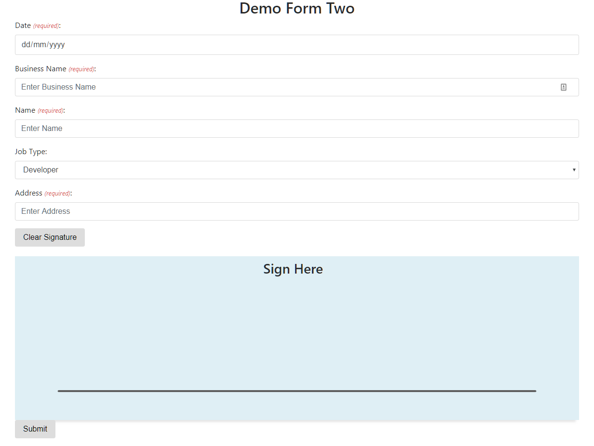

# PHP Form Builder

## Demo
**Demo Form One**

 

**Demo Form Two**

 

## How to use
1. Import the database table under [db](/db) folder
2. Mock up the form fields, refer to [form-builder-example.php](form-builder-example.php)
3. Display the form use `displayForm` function
4. Add actions in form action file (`next-step.php`)
    - WordPress integration already available, include `wp-include.php` in your action file and call `updateForm` to insert, update or delete form entry.
    - Add customized function to action file to handle form submission.

## Todo
1. Add support for other form field types
2. Add edit, download and delete demo
3. Add permission control
4. Add integration for other applications
5. Add database installation 
6. Visualize form builder
7. Convert the form builder to plugin
8. ...
